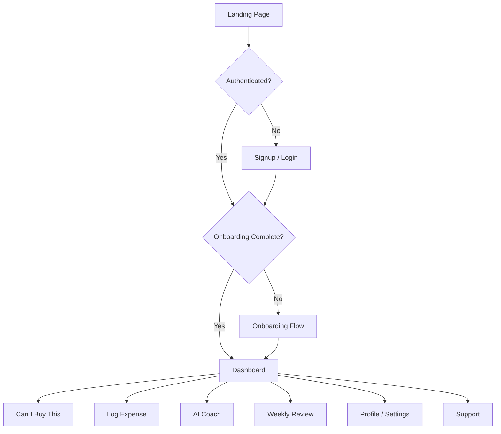

# 03 — Screens & User Flows

Wireframes, layout specifications, and interaction patterns for every major surface.

---

## User Flow Overview



---

## Marketing Website

### Information Architecture

```
/                    Landing
/about               About Nexa
/features            Feature deep-dives (future)
/pricing             Pricing (future-ready waitlist)
/contact             Contact
/privacy             Privacy policy
/terms               Terms
```

### Landing Page Sections (Scroll Order)

1. **Nav** — Logo, Features, How it Works, FAQ, Sign In, Get Started CTA
2. **Hero** — Headline, subhead, dual CTA, product mockup
3. **Social proof** — "Trusted by professionals across Pakistan"
4. **Problem** — "Expense trackers show the past. Nexa guides your future."
5. **Safe To Spend** — Feature spotlight with animated number
6. **Can I Buy This** — Interactive demo or screenshot
7. **How It Works** — 3 steps: Connect finances → Set goals → Get guidance
8. **AI Coach** — Conversation preview
9. **Privacy & Security** — No bank linking, encrypted, PK-first
10. **Testimonials** — 3 cards
11. **FAQ** — Accordion
12. **Pricing** — Waitlist CTA (future tiers ghosted)
13. **Footer** — Links, social, copyright

### Hero Wireframe (Desktop)

```
┌──────────────────────────────────────────────────────────────────────┐
│ [N] Nexa     Features  How it works  FAQ     Sign in  [Get Started]│
├──────────────────────────────────────────────────────────────────────┤
│                                                                      │
│  Pakistan's Financial          ┌─────────────────────────────┐    │
│  Intelligence Platform         │                             │    │
│                                │   [Dashboard Mockup]        │    │
│  Can I afford this while       │   Safe To Spend ₨ 4,250     │    │
│  staying on track?             │   Health 82/100             │    │
│                                │                             │    │
│  [Get Started — Free]          └─────────────────────────────┘    │
│  [See how it works →]                                               │
│                                                                      │
└──────────────────────────────────────────────────────────────────────┘
```

### Hero Typography

- Eyebrow: `label` uppercase, primary color
- Headline: `display-lg` / `text-5xl lg:text-6xl font-bold tracking-tight`
- Subhead: `body-lg text-muted-foreground max-w-xl`

### Marketing Responsive

| Breakpoint | Layout |
|------------|--------|
| Mobile | Stacked hero, mockup below fold, hamburger nav |
| Tablet | 60/40 split hero |
| Desktop | 50/50 split, sticky nav |
| Ultrawide | Content capped at 1200px, mockup scaled |

---

## Authentication

### Pages

| Route | Purpose |
|-------|---------|
| `/login` | Email/password, passkey, magic link |
| `/signup` | Name, email, password, terms |
| `/forgot-password` | Email input |
| `/reset-password` | New password + confirm |
| `/verify-email` | Verification status |

### Auth Layout Wireframe

```
┌─────────────────────────────────────────────────────────────┐
│                                                             │
│     ┌─────────────────────────┐    ┌─────────────────────┐ │
│     │                         │    │                     │ │
│     │  [N] Nexa               │    │  Welcome back       │ │
│     │                         │    │                     │ │
│     │  "Make confident        │    │  Email              │ │
│     │   money decisions       │    │  Password           │ │
│     │   every day."           │    │                     │ │
│     │                         │    │  [Sign in]          │ │
│     │  Feature bullets        │    │  ─── or ───         │ │
│     │                         │    │  [Google]           │ │
│     │                         │    │  [Passkey]          │ │
│     │                         │    │  [Magic link]       │ │
│     └─────────────────────────┘    └─────────────────────┘ │
│          Brand panel (lg+)              Form card           │
└─────────────────────────────────────────────────────────────┘
```

Mobile: form only, brand panel hidden.

### Auth States

| State | UI |
|-------|-----|
| Loading | Button spinner, inputs disabled |
| Error | Inline destructive text below form |
| Magic link sent | Centered card, email illustration |
| Success | Redirect with toast |

### OAuth Button

```
[ G ] Continue with Google
```

Outline variant, Google icon left, full width.

---

## Onboarding Flow

**Goal:** Complete in under 5 minutes. Progressive disclosure. Save progress per step.

### Steps

| Step | Title | Fields |
|------|-------|--------|
| 1 | Welcome | Value prop, privacy note, Begin |
| 2 | Income | Income sources (name + amount), add/remove rows |
| 3 | Pay Cycle | Payday, cycle start, freelancer toggle |
| 4 | Fixed Expenses | Rent, utilities, subscriptions (preset + custom) |
| 5 | Variable Spending | Monthly estimate slider/input |
| 6 | Starting Balance | Current cash in hand |
| 7 | Goals | Emergency fund (auto), custom goals |
| 8 | Preferences | Theme, currency confirm (PKR) |
| 9 | Notifications | Optional email/push toggles |
| 10 | Summary | Review all inputs, edit links |
| 11 | Complete | Celebration, "Go to Dashboard" |

### Progress Indicator

```
Step 3 of 10 — Pay Cycle
[████████░░░░░░░░░░░░] 30%
```

- Step dots on mobile (compact)
- Back button always visible except step 1
- Continue disabled until step valid (Zod)

### Onboarding Wireframe

```
┌─────────────────────────────────────────────────────────────┐
│ [N] Nexa                              Step 3 of 10          │
│ [████████░░░░░░░░░░░░]                                      │
├─────────────────────────────────────────────────────────────┤
│                                                             │
│  When do you get paid?                                      │
│  This helps Nexa calculate your financial cycle.            │
│                                                             │
│  Primary payday        [ 5 ▼ ]  of each month               │
│  Cycle starts on       [ 1 ▼ ]                              │
│  □ I'm a freelancer (irregular income)                      │
│                                                             │
│              [← Back]              [Continue →]             │
└─────────────────────────────────────────────────────────────┘
```

Max content width: 560px centered.

---

## User Dashboard

The heart of Nexa. Answers three questions at a glance:

1. **How am I doing?** — Health score + Safe To Spend
2. **What should I do next?** — AI insight + recommendations
3. **Can I safely spend today?** — Hero metric

### Dashboard Wireframe (Desktop)

```
┌──────────┬──────────────────────────────────────────────────────────┐
│ Sidebar  │  Good afternoon, Ahmed                    [Can I Buy?]   │
│          │  ────────────────────────────────────────────────────────  │
│ Dashboard│  ┌─ Today's Insight ──────────────────────────────────┐  │
│ Can I Buy│  │ You're on track. Safe to spend is above baseline.  │  │
│ Review   │  └────────────────────────────────────────────────────┘  │
│ AI Coach │                                                            │
│ Profile  │  ┌─ Safe To Spend ──────┐  ┌─ Financial Health ────────┐ │
│ Help     │  │  ₨ 4,250             │  │  82 / 100                 │ │
│          │  │  Baseline ₨ 3,800    │  │  ●●●●○ Good               │ │
│          │  └──────────────────────┘  └───────────────────────────┘ │
│          │                                                            │
│          │  ┌─ Income ─┐ ┌─ Spent ──┐ ┌─ Projected Savings ──────┐ │
│          │  │ ₨ 120k  │ │ ₨ 45k   │ │ ₨ 32k (27% / 30% target)  │ │
│          │  └─────────┘ └─────────┘ └───────────────────────────┘ │
│          │                                                            │
│          │  ┌─ Quick Log ──────────────────────────────────────────┐ │
│          │  │ [Amount] [Description] [Category ▼] [Log ⌘↵]        │  │
│          │  └────────────────────────────────────────────────────┘  │
│          │                                                            │
│          │  ┌─ Goals ──────────────┐  ┌─ Recent Transactions ──────┐ │
│          │  │ Emergency ████░ 67%  │  │ Coffee        −₨ 450       │ │
│          │  │ Laptop    ██░░░ 40%  │  │ Salary        +₨ 120,000   │ │
│          │  └──────────────────────┘  └────────────────────────────┘ │
└──────────┴──────────────────────────────────────────────────────────┘
```

### Mobile Dashboard

Priority stack (top to bottom):
1. Safe To Spend (full width hero)
2. Quick log (sticky bottom bar option)
3. Insight
4. Health + cash row (2-col)
5. Goals (horizontal scroll cards)
6. Transactions (last 5)

### Dashboard Components Priority

| Priority | Component | Visibility |
|----------|-----------|------------|
| P0 | Safe To Spend | Always above fold |
| P0 | Quick Log | Always accessible |
| P1 | AI Insight | When available |
| P1 | Financial Health | Above fold |
| P2 | Cash summary row | Below fold |
| P2 | Goals | Below fold |
| P3 | Variance | Conditional |
| P3 | Charity | Footer meta |

---

## Expense Logging

**Principle:** Fastest path is ≤ 3 interactions.

### Inline Logger (Dashboard)

```
┌─────────────────────────────────────────────────────────────┐
│  ₨ [________]  [What was it?________]  [Category ▼]  [Log] │
│  Recent: Food · Fuel · Shopping                              │
└─────────────────────────────────────────────────────────────┘
```

- `⌘+Enter` / `Ctrl+Enter` submits
- Natural language: "coffee 450" parses amount + description
- Optimistic UI: transaction appears immediately, toast on confirm
- Recurring suggestion chip if pattern detected

### Full Log Modal (Mobile)

Bottom sheet with amount keypad-style input.

---

## Goals

### Goal Card

```
┌─────────────────────────────────────┐
│  🎯 Emergency Fund          On track │
│  ┌──────┐                            │
│  │ 67%  │  ₨ 200,000 of ₨ 300,000   │
│  └──────┘  ETA March 2027            │
│  ████████████░░░░░░                  │
└─────────────────────────────────────┘
```

- Progress ring on card thumbnail
- Milestone celebrations at 25/50/75/100%
- Delayed goals: warning badge, not red (avoid anxiety)

---

## AI Coach (`/chat`)

### Layout

```
┌─────────────────────────────────────────────────────────────┐
│  AI Coach                                    [New chat]     │
├─────────────────────────────────────────────────────────────┤
│                                                             │
│  ┌─────────────────────────────────────────┐               │
│  │ How can I reduce spending this week?    │  User         │
│  └─────────────────────────────────────────┘               │
│                                                             │
│  Coach                                                      │
│  ┌─────────────────────────────────────────┐               │
│  │ Based on your cycle, dining is 23% over │               │
│  │ expected. Reducing by ₨ 2,000/week...  │               │
│  │                                         │               │
│  │ [Chart: category breakdown]             │               │
│  │                                         │               │
│  │ [Set dining limit]  [Dismiss]           │               │
│  └─────────────────────────────────────────┘               │
│                                                             │
│  [Can I afford ₨ 50k laptop?] [Am I on track?] [Tips]      │
│                                                             │
│  ┌───────────────────────────────────────┐ [Send]          │
│  │ Ask your coach...                     │                 │
│  └───────────────────────────────────────┘                 │
└─────────────────────────────────────────────────────────────┘
```

- Streaming responses with typing indicator
- Trust footer: "Nexa uses your data only — never shared"
- Suggestion chips above input

---

## Can I Buy This (`/can-i-buy`)

Full-page version of dialog flow with richer result:

- Purchase input with amount + description
- Optional: link/image (future)
- Result panel with verdict, impact breakdown, alternatives
- "Similar purchases you've made" context (future)

---

## Weekly Review (`/weekly-review`)

- Cycle summary card
- Spending by category chart
- Wins + areas to improve
- AI-generated weekly narrative
- CTA: adjust goals or set intention for next week

---

## Profile & Settings

Sections:
- Account (name, email)
- Security (passkey, password, sessions)
- Data & Privacy (export, delete account)
- Activity log
- Preferences (theme, notifications)

---

## Admin Dashboard

### IA

```
/admin                 Overview
/admin/users           User management
/admin/users/[id]      User detail
/admin/analytics       Product analytics
/admin/support         Ticket queue
/admin/health          API & system health
/admin/errors          Error tracking
/admin/audit           Audit logs
```

### Overview Wireframe

```
┌──────────┬──────────────────────────────────────────────────────────┐
│ Admin    │  Operations Dashboard                    [Deploy status ●]│
│ Nav      │  ────────────────────────────────────────────────────────  │
│          │  ┌─────┐ ┌─────┐ ┌─────┐ ┌─────┐ ┌─────┐                  │
│ Overview │  │Users│ │ DAU │ │ New │ │Tix  │ │ Err │                  │
│ Users    │  │12.8k│ │ 842 │ │  23 │ │  7  │ │  3  │                  │
│ Analytics│  └─────┘ └─────┘ └─────┘ └─────┘ └─────┘                  │
│ Support  │                                                            │
│ Health   │  ┌─ DAU Trend (7d) ──────────┐ ┌─ Top Events ──────────┐  │
│ Errors   │  │ [Line chart]              │ │ safe_to_spend_viewed  │  │
│ Audit    │  └───────────────────────────┘ │ dashboard_viewed      │  │
│          │                                └───────────────────────┘  │
└──────────┴──────────────────────────────────────────────────────────┘
```

- Dense but scannable
- Monospace for all metrics
- Real-time badge on overview (pulse dot)

---

## Analytics Dashboard (PostHog Replacement)

### Sections

| Tab | Metrics |
|-----|---------|
| Growth | Signups, DAU, WAU, MAU, activation rate |
| Retention | Cohort grid, D1/D7/D30 |
| Funnels | Signup → Onboard → First log → D7 return |
| Events | Event volume, top events, custom queries |
| Features | Can I Buy usage, AI Coach sessions |
| Performance | P50/P95 latency, API response times |
| Errors | Error rate, top errors, stack traces |
| Sessions | Duration, pages/session |
| Devices | Mobile/desktop/tablet split |
| Geography | Pakistan city breakdown (anonymized) |
| Realtime | Live user count, events/minute |

### Chart Style

- Consistent with user dashboard charts
- Date range picker top-right
- Export CSV on all tables
- Comparison period toggle (vs previous)

---

## Support Portal

### User (`/support`)

```
┌─────────────────────────────────────────────────────────────┐
│  Help Center                                                │
│                                                             │
│  ┌─────────────┐ ┌─────────────┐ ┌─────────────┐           │
│  │ Report Bug  │ │ Feature Req │ │ Feedback    │           │
│  └─────────────┘ └─────────────┘ └─────────────┘           │
│                                                             │
│  Knowledge Base                                             │
│  [Search articles...]                                       │
│  • How Safe To Spend works                                  │
│  • Understanding your cycle                                 │
│  • Privacy & data                                           │
└─────────────────────────────────────────────────────────────┘
```

Auto-attach support snapshot (dashboard state, no sensitive data).

### Admin (`/admin/support`)

- Ticket queue with filters (status, priority)
- Ticket detail: conversation, attachments, internal notes
- Snapshot viewer (read-only dashboard reproduction)
- Status workflow: Open → In Progress → Resolved → Closed

---

## Error Pages

| Page | Headline | CTA |
|------|----------|-----|
| 404 | "This page doesn't exist" | Go to Dashboard |
| 500 | "Something went wrong" | Retry + Contact support |
| Offline | "You're offline" | Retry when connected |

All include illustration + friendly copy. Never blame the user.

---

## Responsive Layout Matrix

| Surface | Mobile | Tablet | Desktop |
|---------|--------|--------|---------|
| Marketing | 1-col, sheet nav | 2-col hero | Full layout |
| Auth | Form only | Form centered | Split panel |
| Dashboard | Stack, bottom log | 2-col grid | Sidebar + grid |
| Admin | Card stack | 2-col stats | Full grid |
| Analytics | Tab per section | 2-col charts | Multi-panel |
| Chat | Full screen | Full screen | Fixed width 720px |

Do not shrink desktop layouts — redesign per breakpoint.
